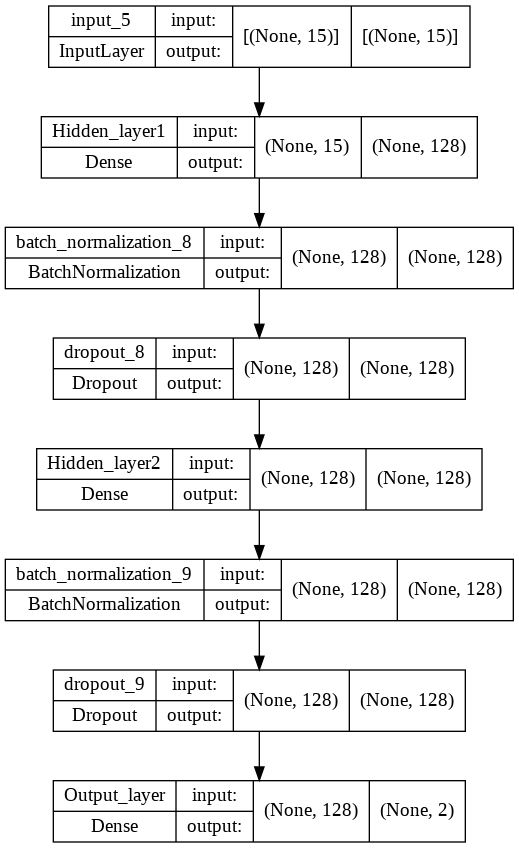
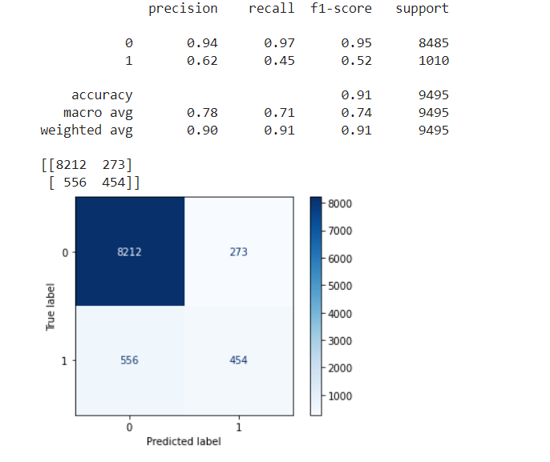

# Customer_segmentation_using_Deep_Learning
The bank's revenue has recently decreased, and an examination has been done to determine the cause of the issue. The bank discovered that the decline in client deposits of money into the bank is the primary cause of the decrease in revenue. As a result, the bank made the decision to launch marketing initiatives to encourage more customers to make deposits. Gathering client demands and general satisfaction is the goal of marketing campaigns. The consumer segmentation, promotional strategy, and other key components of the marketing campaign are among its key components. The revenue of the bank could increase and increase with a well determined plan.

Our focus here is to create a deep learning model to forecast the campaign's outcome based on the segmentation dataset thst comes with few features.

# Results
The architecture of our model is such below:

Upon our studies, we found out that we can get better accuracy with all the features been selected. Hence we skip the future selection step in this case.
This model accuracy were as high as 91%. Hence it is suggested that this model to be used for future prediction.

 

# Credit

Data sets : [Here](https://www.kaggle.com/datasets/kunalgupta2616/hackerearth-customer-segmentation-hackathon)

